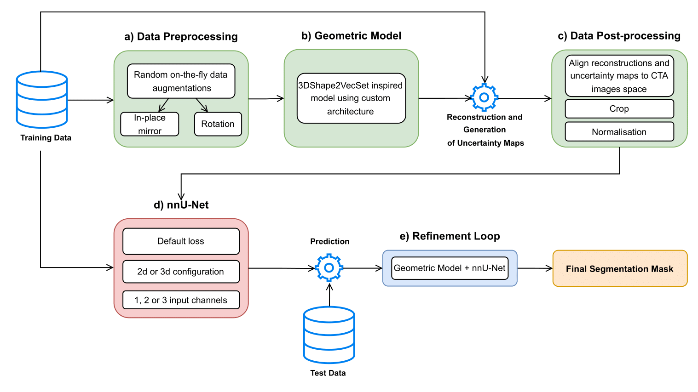
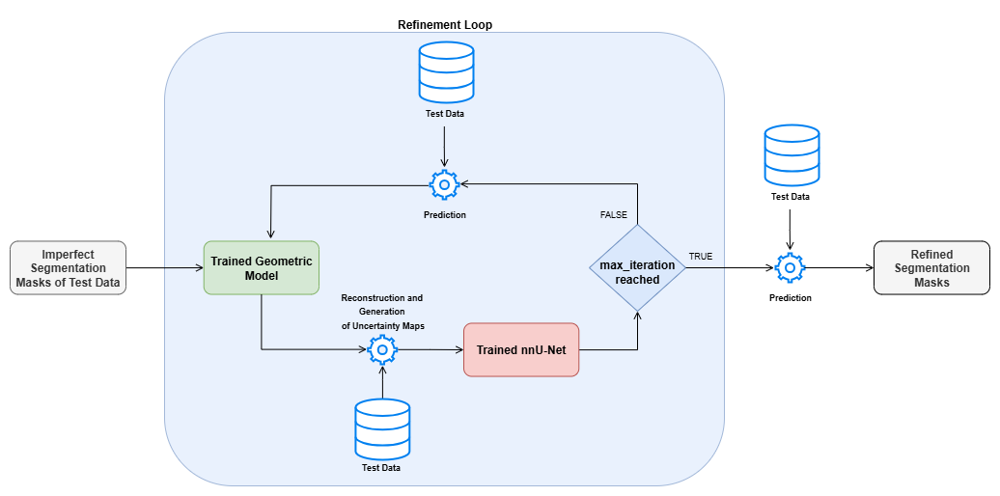

# Welcome to the repository of Geometry-Augmented Inputs for Enhanced 3D Vessel Segmentation

This README describes the necessary steps to reproduce the workflow for anatomical segmentation and shape reconstruction of the Circle of Willis (CoW), leveraging nnUNet, DeepSDF, and 3DShape2VecSet.



## Step-by-Step Workflow

### 1. Install nnUNet

Follow installation instructions from the official nnUNet repository: [nnUNet Installation Instructions](https://github.com/MIC-DKFZ/nnUNet)

### 2. Download TopCoW Dataset

Download the TopCoW dataset from: [TopCoW Challenge](https://topcow24.grand-challenge.org/data/).

If using this dataset, cite the following:

```bibtex
@misc{topcowchallenge,
    title={Benchmarking the CoW with the TopCoW Challenge: Topology-Aware Anatomical Segmentation of the Circle of Willis for CTA and MRA},
    author={Kaiyuan Yang et al.},
    year={2024},
    eprint={2312.17670},
    archivePrefix={arXiv},
    primaryClass={cs.CV},
    url={https://arxiv.org/abs/2312.17670},
}
```

### 3. Prepare Dataset for training

Follow nnUNet's instructions to place the dataset into the correct nnUNet directory structure. \
In our case we used 100 patients for the training phase and 25 patients for the testing phase as we had access to 125 ground truth labels from the TopCoW dataset, the split was as follow:
* 100 training patients: 001, 003, 004, 006, 008, 009, 011, 012, 013, 015, 017, 018, 019, 021, 022, 023, 025, 026, 027, 029, 030, 031, 032, 033, 034, 035, 036, 038, 039, 040, 041, 042, 043, 045, 046, 047, 048, 049, 050, 051, 052, 053, 054, 055, 056, 057, 058, 060, 062, 063, 064, 066, 068, 069, 070, 071, 072, 073, 074, 075, 076, 077, 078, 080, 081, 082, 083, 084, 085, 086, 087, 088, 090, 131, 132, 133, 134, 135, 136, 137, 138, 139, 140, 141, 142, 144, 147, 148, 149, 150, 152, 153, 155, 156, 157, 158, 159, 160, 162, 164, 165
* 25 test patients: 002, 005, 007, 010, 014, 016, 020, 024, 028, 037, 044, 046, 059, 061, 065, 067, 072, 079, 089, 145, 146, 151, 154, 161, 163


### 4. Label Conversion

Convert segmentation label 15 to label 13:

```bash
python nnUNet_convert_segment_labels.py \
    --input_dir path/to/ground_truth_labels \
    --output_dir path/to/output_labels
```

---

## DeepSDF Workflow

### 1. Data Augmentation

Create data augmentations using:

```bash
python geometric_model/data_augmentations.py \
    --input_dir path/to/ground_truth_labels \
    --output_dir path/to/augmented_ground_truth_labels
```

### 2. Prepare SDF Samples

Generate latent vectors:

```bash
python geometric_model/prepare_sdf_samples.py \
    --input_folder path/to/augmented_ground_truth_labels \
    --output_folder npz_output \
    --num_points 5000
```

### 3. Train DeepSDF

Start training:

```bash
python main_deep_sdf.py \
    --npz_folder npz_output \
    --num_epochs 2500 \
    --do_code_regularization
```

### 4. Shape Reconstruction

Reconstruct shapes with:

```bash
python geometric_model/reconstruct_mesh.py \
    --checkpoint path/to/trained_model.pth \
    --segmentation_dir path/to/augmented_ground_truth_labels \
    --output_dir path/to/reconstructed_shapes \
    --resolution 512 \
    --opt_num_iters 2500 \
    --latent_only
```

---

## 3DShape2VecSet Workflow

### 1. Train 3DShape2VecSet

```bash
python main_3dShape2VecSet.py \
    --data_path path/to/ground_truth_labels \
    --model ae_d64_256_depth6_outdim2 \
    --point_cloud_size 2048 \
    --batch_size 16 \
    --epochs 10000 \
    --lr 1e-4 \
    --pin_mem \
    --num_workers 18 \
    --output_dir ./geo_train_output/ae_d64_256_depth6_recon+NLL_02_-7_4_clamped/ \
    --nll_weight 0.2
```

### 2. Inference

Run inference using the trained model:

```bash
python eval_3dShape2VecSet.py \
    --model ae_d64_256_depth6_outdim2 \
    --pth /thesis-GILPEVS/geo_train_output/ae_d64_256_depth6_recon+NLL_02_-7_4_clamped/checkpoint-9999.pth \
    --data_path TopCoW \
    --cta_img_dir path/to/imagesTs \
    --gt_mask_dir path/to/labelsTs \
    --output_dir path/to/output_directory
```

### 3. Normalization and Transformation

Normalize and align reconstructed shapes to align with TopCow:

```bash
python _3DShape2VecSet/util/uncertainty_map_normalisation.py \
    --train_dir path/to/reconstructed_shapes
```

---

## Important Notes:

* Create separate nnUNet datasets for different configurations:

  * Raw CTA
  * Raw CTA + Uncertainty Map
  * Raw CTA + Uncertainty Map + Distance Maps

* Train nnUNet without mirroring augmentation on TopCoW:

```bash
-tr nnUNetTrainerNoMirroring
```

* Use the best performing checkpoint from nnUNet (`checkpoint_best.pth`) for inference.

## Refinement loop



To further refine predictions, use the following command:

```bash
python refinement_pipeline.py \
    --cta_dir path/to/imagesTs \
    --initial_masks path/to/initial_predictions \
    --data_path path/to/initial_predictions \
    --geo_script path/to/eval_3dShape2VecSet.py \
    --geo_ckpt path/to/3DShape2VecSet_checkpoint.pth \
    --postproc_script path/to/uncertainty_map_normalisation.py \
    --nnunet_task 015 --nnunet_config 3d_fullres \
    --nnunet_checkpoint checkpoint_best.pth \
    --use_distance --iterations 10 \
    --work_dir path/to/refined_segmentation_masks
```

## Calculate Metrics

To compute the final evaluation metrics for your predictions, run:

```bash
python calculate_metrics.py \
    --pred_dir path/to/predictions \
    --gt_dir path/to/labelsTs \
    --output path/to/metrics_summary.json
```

Results from experiments conducted during my thesis are included in `metrics_results/015`, `metrics_results/016`, and `metrics_results/017`.
* 015 is the dataset with 3 input channels: raw CTA, uncertainty map, and distance map. 
* 016 is the dataset with 2 input channels: raw CTA, and uncertainty map. 
* 017 is the dataset with a single input channel: raw CTA. 